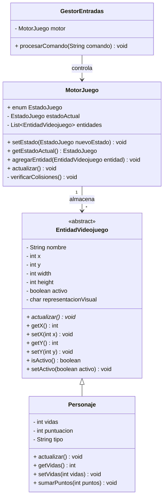
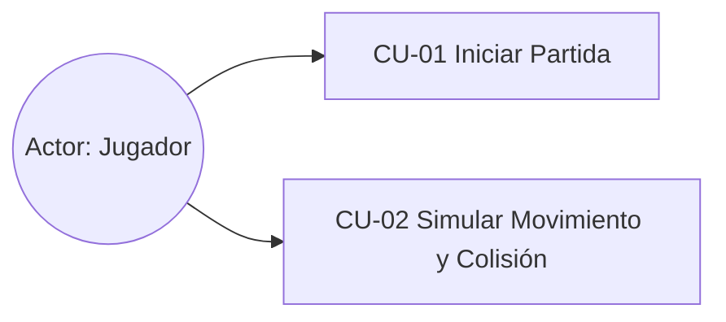

# Motor de Videojuego 2D - Estilo Super Mario Bros

Este repositorio contiene la implementación asistida por IA de la lógica interna de control (sin interfaz gráfica) para un motor básico de un videojuego de plataformas en 2D inspirado en la temática clásica de Super Mario Bros.

## 1. Arquitectura del Software

El diseño del sistema sigue un enfoque orientado a objetos minimalista, limitando la estructura a 5 clases clave para garantizar la modularidad y el cumplimiento de las restricciones técnicas:

* **Main**: Clase conductora que inicializa el entorno, registra las entidades y ejecuta la simulación del bucle de juego (*Game Loop*) imprimiendo el estado por consola.
* **MotorJuego**: El cerebro del motor. Gestiona el estado de la partida (`MENU`, `JUGANDO`, `GAME_OVER`), almacena la lista de entidades y ejecuta las colisiones.
* **EntidadVideojuego (Abstracta)**: Define las propiedades fundamentales de cualquier objeto del juego, asegurando el encapsulamiento de coordenadas `(x, y)`, dimensiones y su representación visual.
* **Personaje**: Hereda de `EntidadVideojuego`. Extiende el comportamiento para modelar tanto al jugador (`JUGADOR`) como a los enemigos (`ENEMIGO`), encapsulando estadísticas como vidas y puntuación, además de la lógica autónoma del NPC.
* **GestorEntradas**: Clase encargada de procesar comandos del jugador simulando las interacciones táctiles o físicas del usuario.

---

## 2. Diagrama de Clases UML (Mermaid)

---

## 3. Diagrama de Casos de Uso UML (Mermaid)

---

## 4. Especificación de Casos de Uso

### Caso de Uso 1: Iniciar Partida

| Campo               | Descripción                                                                                                                                                             |
| ------------------- | ----------------------------------------------------------------------------------------------------------------------------------------------------------------------- |
| Nombre              | CU-01 Iniciar Partida                                                                                                                                                   |
| Objetivo            | Cambiar el estado del motor a modo activo para comenzar la simulación del videojuego                                                                                    |
| Actor Principal     | Jugador                                                                                                                                                                 |
| Precondiciones      | El sistema debe encontrarse en el estado inicial MENU                                                                                                                   |
| Flujo Principal     | 1. El jugador envía la orden de inicio. 2. El sistema cambia el atributo de control a JUGANDO. 3. El sistema imprime por consola la confirmación del nuevo estado |
| Flujos Alternativos | No aplica                                                                                                                                                               |
| Postcondiciones     | El motor queda habilitado para procesar los ciclos de actualización de las entidades                                                                                    |
| Reglas de Negocio   | No se puede iniciar una nueva partida si el estado actual ya es JUGANDO                                                                                                 |

### Caso de Uso 2: Simular Movimiento y Colisión

| Campo               | Descripción                                                                                                                                                                                                                            |
| ------------------- | -------------------------------------------------------------------------------------------------------------------------------------------------------------------------------------------------------------------------------------- |
| Nombre              | CU-02 Simular Movimiento y Colisión                                                                                                                                                                                                    |
| Objetivo            | Actualizar la posición de los enemigos y verificar colisiones                                                                                                                                                                          |
| Actor Principal     | Jugador / Sistema                                                                                                                                                                                                                      |
| Precondiciones      | El motor debe estar en estado JUGANDO y contar con al menos dos entidades activas                                                                                                                                                      |
| Flujo Principal     | 1. El motor ejecuta `actualizar()`. 2. El enemigo modifica su posición X automáticamente. 3. El método `verificarColisiones()` detecta coincidencia de coordenadas. 4. Se resta una vida al jugador y se notifica por consola |
| Flujos Alternativos | 3a. Si las coordenadas no coinciden, no ocurre ninguna modificación                                                                                                                                                                    |
| Postcondiciones     | El jugador pierde una vida. Si llega a 0 vidas, el estado cambia a GAME_OVER                                                                                                                                                           |
| Reglas de Negocio   | Las colisiones solo se evalúan entre entidades activas (`activo == true`)                                                                                                                                                              |

---

## 5. Bitácora del Uso de Inteligencia Artificial

### Herramienta Utilizada

Se ha empleado Gemini de Google, actuando bajo el rol asignado de Arquitecto de Software Senior y Asistente Experto en Desarrollo de Videojuegos.

### Muestra de Prompts

> «Se pide diseñar e implementar de forma asistida por IA la lógica interna de control (sin interfaz gráfica) de un núcleo o motor básico para un videojuego estilo marioBros.»

> «Tengo un error en el main: `motor.estadoActual` sale subrayado en rojo. ¿Cómo lo soluciono?»

> «Crea un Diagrama de Casos de Uso UML usando Mermaid»

### Control de Errores de la IA

Durante la fase de integración de los componentes, la IA propuso el acceso directo a la variable miembro `estadoActual` desde la clase conductora `Main`. Esto generó un error de compilación por violación de visibilidad (`private`).

**Corrección:** Se detectó manualmente la falta de encapsulamiento y se corrigió el diseño implementando el método consultor `getEstadoActual()`, garantizando así las buenas prácticas de desarrollo orientado a objetos.

### Reflexión Crítica

**Ventajas:** La asistencia de modelos de lenguaje permite agilizar la estructuración del diseño de clases, la generación de código Java y la creación de diagramas UML en formato Mermaid.

**Peligros:** El desarrollador puede aceptar soluciones generadas sin validar restricciones del lenguaje o errores de diseño. Resulta indispensable revisar críticamente cada propuesta y verificar su correcto funcionamiento.
